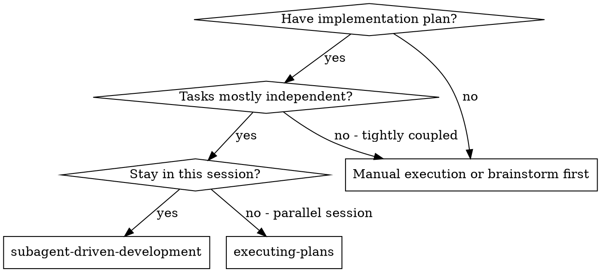
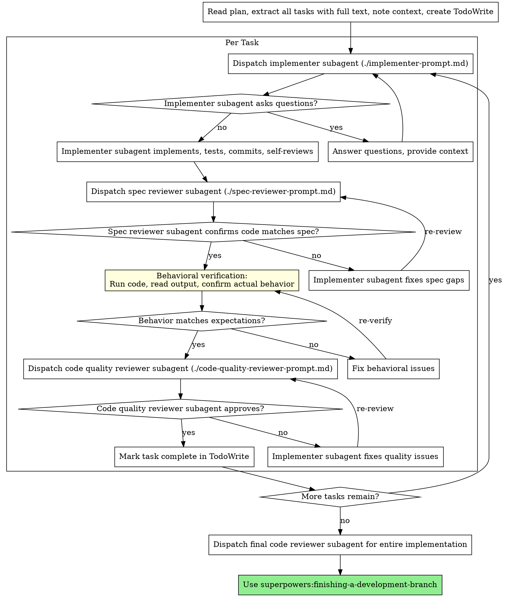

# Subagent-Driven Development

Execute plan by dispatching fresh subagent per task, with three-stage review after each: spec compliance review first, then behavioral verification, then code quality review.

**Why subagents:** You delegate tasks to specialized agents with isolated context. By precisely crafting their instructions and context, you ensure they stay focused and succeed at their task. They should never inherit your session's context or history — you construct exactly what they need. This also preserves your own context for coordination work.

**Core principle:** Fresh subagent per task + three-stage review (spec → behavior → quality) = high quality, fast iteration

## Behavioral Verification (Critical)

There are three different things that are easily confused:

1. **Spec-to-code matching** — "코드가 문서와 같은 말을 하는가?" (spec compliance)
2. **Tests passing** — "테스트가 통과하는가?" (test verification)
3. **Actual behavior matching intent** — "우리가 원했던 것이 실제로 달성되었는가?" (behavioral verification)

These are NOT the same. Tests can pass while the actual intent is unmet. Spec can match code while the code doesn't do what we wanted. **All three must be independently confirmed.**

After spec compliance passes, YOU (the coordinator) must verify actual behavior:

1. **Read the changed files** — don't trust the subagent's report. Read the actual code with your own eyes.
2. **Run the code** — execute tests, run the actual program, call the actual API. Read the output yourself.
3. **Write a completion report** — follow the format below. Do NOT claim completion without this report.

### Completion Report Format

Every implementation must end with a completion report that covers all of the following:

**1. 목표 (Goal):** 원래 문제 정의를 그대로 가져온다. "우리가 뭘 원했는가?"

**2. 달성된 것 (Achieved):** 각 목표 항목에 대해:
- 어떻게 해결되었는지 구체적으로 설명한다.
- 어떤 증거로 확인했는지 명시한다 (테스트 출력, 실제 실행 로그, API 응답 등).
- "확인했다"의 기준은 직접 실행/조회한 결과이지, 서브에이전트의 보고가 아니다.

**3. 미확인 (Unverified):** 확인하지 못한 부분을 숨기지 말고 전부 나열한다.
- 왜 확인하지 못했는지 (예: API 키 없음, 에러 재현 불가).
- 확인하려면 뭘 해야 하는지.

**4. 미확인 항목 검증:** 미확인 목록의 각 항목을 하나씩 검증한다.
- 검증 가능한 것은 즉시 실행하여 확인한다.
- 검증 불가능한 것은 왜 불가능한지, 어떤 조건이 충족되면 검증할 수 있는지 명시한다.

**5. 최종 결론:** 모든 미확인 항목이 해소된 후에만 "완료"를 선언한다. 해소되지 않은 미확인이 있으면 "조건부 완료"로 명시하고 남은 항목을 기록한다.

### Example

```
## 목표
업로드 후 위하고에 실제로 등록되었는지 확인하는 단계가 없다 → sequence로 확인하고, 없으면 저장하지 않는다.

## 달성된 것
- 성공 경로: main_direct.py 전체 흐름 실행 → 토스페이먼츠 23,920원 → 업로드(seq=27) → 검증 통과(0.10초) → JSONL 저장. 실행 로그로 확인.
- verify_upload()가 실제 위하고 API를 호출: e2e 테스트에서 True/False 올바르게 반환 확인.

## 미확인
- 실패 경로: 검증 실패 시 RuntimeError가 발생하고 JSONL 저장이 차단되는지.

## 미확인 항목 검증
- 실패 경로: 존재하지 않는 sequence(999999)로 동일 로직 실행 → RuntimeError 발생, 저장 단계 미도달 확인.

## 최종 결론
모든 경로 검증 완료. 완료.
```

### Anti-Pattern

- "e2e 3개 통과, spec 체크리스트 전부 O → 완료" — 테스트와 spec만 확인하고 실제 동작 미검증.
- "달성된 것"만 나열하고 "미확인"을 생략 — 모르는 것을 숨기는 것.
- "미확인"을 나열만 하고 검증하지 않음 — 미확인을 인식했으면 검증까지 해야 한다.

## When to Use



**vs. Executing Plans (parallel session):**
- Same session (no context switch)
- Fresh subagent per task (no context pollution)
- Three-stage review after each task: spec compliance → behavioral verification → code quality
- Faster iteration (no human-in-loop between tasks)

## The Process



## Model Selection

Use the least powerful model that can handle each role to conserve cost and increase speed.

**Mechanical implementation tasks** (isolated functions, clear specs, 1-2 files): use a fast, cheap model. Most implementation tasks are mechanical when the plan is well-specified.

**Integration and judgment tasks** (multi-file coordination, pattern matching, debugging): use a standard model.

**Architecture, design, and review tasks**: use the most capable available model.

**Task complexity signals:**
- Touches 1-2 files with a complete spec → cheap model
- Touches multiple files with integration concerns → standard model
- Requires design judgment or broad codebase understanding → most capable model

## Handling Implementer Status

Implementer subagents report one of four statuses. Handle each appropriately:

**DONE:** Proceed to spec compliance review.

**DONE_WITH_CONCERNS:** The implementer completed the work but flagged doubts. Read the concerns before proceeding. If the concerns are about correctness or scope, address them before review. If they're observations (e.g., "this file is getting large"), note them and proceed to review.

**NEEDS_CONTEXT:** The implementer needs information that wasn't provided. Provide the missing context and re-dispatch.

**BLOCKED:** The implementer cannot complete the task. Assess the blocker:
1. If it's a context problem, provide more context and re-dispatch with the same model
2. If the task requires more reasoning, re-dispatch with a more capable model
3. If the task is too large, break it into smaller pieces
4. If the plan itself is wrong, escalate to the human

**Never** ignore an escalation or force the same model to retry without changes. If the implementer said it's stuck, something needs to change.

## Prompt Templates

- `./implementer-prompt.md` - Dispatch implementer subagent
- `./spec-reviewer-prompt.md` - Dispatch spec compliance reviewer subagent
- `./code-quality-reviewer-prompt.md` - Dispatch code quality reviewer subagent

## Example Workflow

```
You: I'm using Subagent-Driven Development to execute this plan.

[Read plan file once: docs/superpowers/plans/feature-plan.md]
[Extract all 5 tasks with full text and context]
[Create TodoWrite with all tasks]

Task 1: Hook installation script

[Get Task 1 text and context (already extracted)]
[Dispatch implementation subagent with full task text + context]

Implementer: "Before I begin - should the hook be installed at user or system level?"

You: "User level (~/.config/superpowers/hooks/)"

Implementer: "Got it. Implementing now..."
[Later] Implementer:
  - Implemented install-hook command
  - Added tests, 5/5 passing
  - Self-review: Found I missed --force flag, added it
  - Committed

[Dispatch spec compliance reviewer]
Spec reviewer: ✅ Spec compliant - all requirements met, nothing extra

[Get git SHAs, dispatch code quality reviewer]
Code reviewer: Strengths: Good test coverage, clean. Issues: None. Approved.

[Mark Task 1 complete]

Task 2: Recovery modes

[Get Task 2 text and context (already extracted)]
[Dispatch implementation subagent with full task text + context]

Implementer: [No questions, proceeds]
Implementer:
  - Added verify/repair modes
  - 8/8 tests passing
  - Self-review: All good
  - Committed

[Dispatch spec compliance reviewer]
Spec reviewer: ❌ Issues:
  - Missing: Progress reporting (spec says "report every 100 items")
  - Extra: Added --json flag (not requested)

[Implementer fixes issues]
Implementer: Removed --json flag, added progress reporting

[Spec reviewer reviews again]
Spec reviewer: ✅ Spec compliant now

[Dispatch code quality reviewer]
Code reviewer: Strengths: Solid. Issues (Important): Magic number (100)

[Implementer fixes]
Implementer: Extracted PROGRESS_INTERVAL constant

[Code reviewer reviews again]
Code reviewer: ✅ Approved

[Mark Task 2 complete]

...

[After all tasks]
[Dispatch final code-reviewer]
Final reviewer: All requirements met, ready to merge

Done!
```

## Advantages

**vs. Manual execution:**
- Subagents follow TDD naturally
- Fresh context per task (no confusion)
- Parallel-safe (subagents don't interfere)
- Subagent can ask questions (before AND during work)

**vs. Executing Plans:**
- Same session (no handoff)
- Continuous progress (no waiting)
- Review checkpoints automatic

**Efficiency gains:**
- No file reading overhead (controller provides full text)
- Controller curates exactly what context is needed
- Subagent gets complete information upfront
- Questions surfaced before work begins (not after)

**Quality gates:**
- Self-review catches issues before handoff
- Two-stage review: spec compliance, then code quality
- Review loops ensure fixes actually work
- Spec compliance prevents over/under-building
- Code quality ensures implementation is well-built

**Cost:**
- More subagent invocations (implementer + 2 reviewers per task)
- Controller does more prep work (extracting all tasks upfront)
- Review loops add iterations
- But catches issues early (cheaper than debugging later)

## Red Flags

**Never:**
- Start implementation on main/master branch without explicit user consent
- Skip reviews (spec compliance OR code quality)
- Proceed with unfixed issues
- Dispatch multiple implementation subagents in parallel (conflicts)
- Make subagent read plan file (provide full text instead)
- Skip scene-setting context (subagent needs to understand where task fits)
- Ignore subagent questions (answer before letting them proceed)
- Accept "close enough" on spec compliance (spec reviewer found issues = not done)
- Skip review loops (reviewer found issues = implementer fixes = review again)
- Let implementer self-review replace actual review (both are needed)
- **Start code quality review before spec compliance is ✅** (wrong order)
- Move to next task while either review has open issues

**If subagent asks questions:**
- Answer clearly and completely
- Provide additional context if needed
- Don't rush them into implementation

**If reviewer finds issues:**
- Implementer (same subagent) fixes them
- Reviewer reviews again
- Repeat until approved
- Don't skip the re-review

**If subagent fails task:**
- Dispatch fix subagent with specific instructions
- Don't try to fix manually (context pollution)

## Integration

**Required workflow skills:**
- **superpowers:using-git-worktrees** - REQUIRED: Set up isolated workspace before starting
- **superpowers:writing-plans** - Creates the plan this skill executes
- **superpowers:requesting-code-review** - Code review template for reviewer subagents
- **superpowers:finishing-a-development-branch** - Complete development after all tasks

**Subagents should use:**
- **superpowers:test-driven-development** - Subagents follow TDD for each task

**Alternative workflow:**
- **superpowers:executing-plans** - Use for parallel session instead of same-session execution
